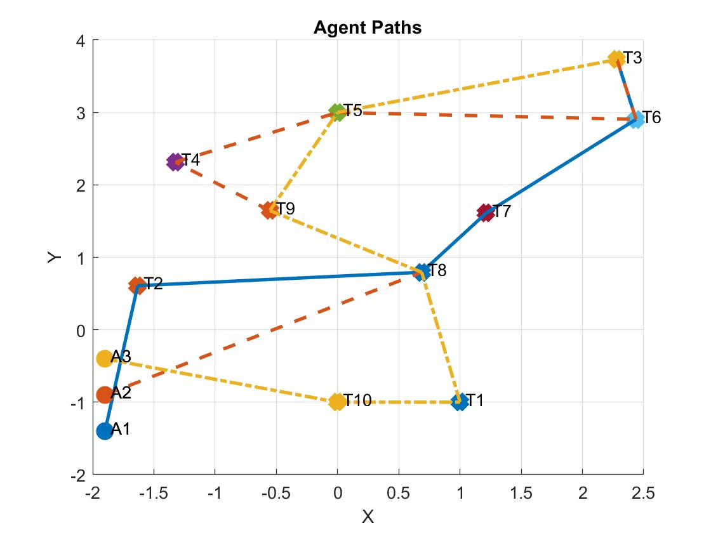
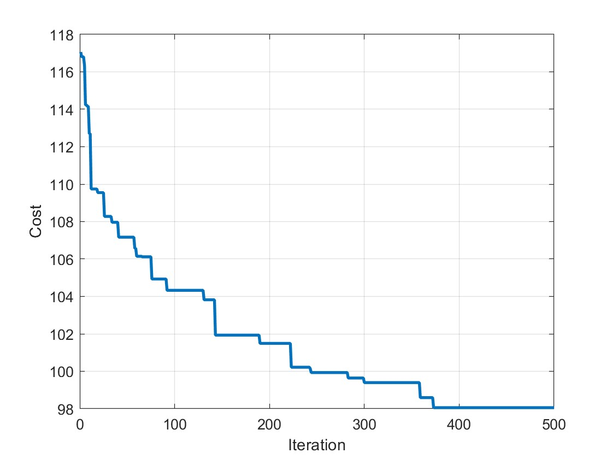

# Cooperative multi robot task allocation using Genertic Algorithm
This is the source code of the Centralized Genetic Algorithm (GA) applied for ST-MR-TA 
(Single task per robots - Multi robots per tasks - time extended) Multi Robot Task Allocation (MRTA) problem.

To run the program, dowload all the source code and run "main.m" in MATLAB.

## Related Paper

Some part of the code implemented based on the approach described in the paper "[PSO-based optimal task allocation for cooperative timing missions](https://doi.org/10.1016/j.ifacol.2016.09.054)" by Oh, Gyeongtaek, Youdan Kim, Jaemyung Ahn, and Han-Lim Choi, published in IFAC-PapersOnLine(2016).

## Results
The result of algorithm with 500 iterations.
| Path | Cost convergence |
| :---:        |     :---:      |
|     |     |
